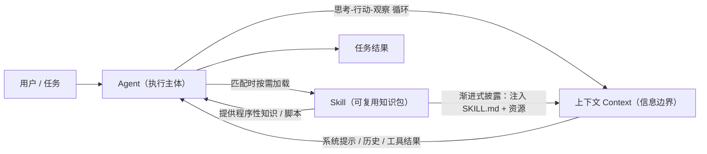

# 三个概念的关系：Agent、大模型的上下文、Skill

## 一句话总结

**上下文（Context）是 Agent 的"信息边界"，Skill 是"注入上下文的可复用知识"**：Agent 在有限的上下文窗口里思考与行动，而 Skill 通过"按需加载"把专业知识塞进上下文、又不占满上下文，从而让 Agent 用更少的上下文做更多的事。

---

## 1. 三者各自扮演的角色

| 维度 | Agent（智能体） | 大模型的上下文（Context） | Skill（技能） |
| --- | --- | --- | --- |
| 本质 | 执行主体 / 运行系统 | 信息输入 / 容量 | 可复用的程序性知识包 |
| 回答的问题 | "做什么、怎么做" | "此刻知道什么" | "这类任务怎么高效做" |
| 关键机制 | 规划 + 工具调用 + 思考-行动-观察循环 | 注意力机制 + 上下文窗口（token 上限） | 渐进式披露（按需加载） |
| 典型产物 | 一次任务的完成结果 | 一次生成所依赖的全部输入 | 一个含 SKILL.md 的文件夹 |
| 在三者中的位置 | 消耗上下文的"工人" | 支撑一切的"燃料" | 节省上下文的"工具说明书" |

---

## 2. 核心关系：上下文如何影响 Agent 的工作

Agent 的每一次推理、每一次工具调用、每一次自我纠正，**都只能基于当前上下文窗口里的信息**。因此：

- **装不下 → 遗忘**：当对话历史 + 工具返回超过窗口上限，最前面的信息会被截断，Agent 会"忘记"任务的最初目标。
- **装太多 → 稀释**：塞进大量无关内容会稀释模型的注意力，既增加延迟和成本，又降低决策质量。
- **装得准 → 高效**：通过"上下文工程"（精简、排序、检索增强等）只喂相关内容，Agent 的表现会显著提升。

> 结论：**Agent 的能力上限，往往不是模型多聪明，而是上下文里"装了什么、装得准不准"。**

---

## 3. 核心关系：Skill 如何沉淀可复用的任务知识

Skill 把一个任务"该怎么做"的程序性知识打包成文件夹（核心是 `SKILL.md`），并借助**渐进式披露（progressive disclosure）**来控制它进入上下文的时机：

1. 启动时，只把每个 Skill 的 `name` + `description` 预加载进上下文（占用极小）；
2. 只有任务匹配时，才读取完整 `SKILL.md`；
3. 需要时才进一步读取附带脚本 / 参考资料。

> 结论：**Skill 本质是一种"把专业知识压缩后、按需解压进上下文"的上下文管理手段**——既增强了 Agent，又不挤占宝贵的上下文。

---

## 4. 三者关系流程图

---

## 5. 我的理解与判断

1. **三者是一条价值链**：上下文是"瓶颈"，Agent 是"消耗者"，Skill 是"省流方案"。
2. **学习顺序**：应先理解**上下文**（信息从哪来、有多大），再理解 **Agent**（信息如何被用来决策与行动），最后理解 **Skill**（如何让 Agent 用更少上下文做更多事）。顺序反了容易把 Skill 误解成"又一个提示词"。
3. **一个可操作的类比**：把 Agent 比作"一名新员工"——上下文是"他此刻桌上能看到的全部资料"，Skill 是"他抽屉里的标准作业手册（SOP）"。员工能干多少活，取决于桌面资料够不够用、有没有按需抽出正确的手册。
4. **对实践的意义**：要优化一个 Agent，优先从"喂给它的上下文"和"沉淀成 Skill 的流程"入手，往往比换更强的模型更有效。

---

## 6. 参考来源

- Anthropic《Building effective agents》：<https://www.anthropic.com/engineering/building-effective-agents>
- Anthropic《Effective context engineering for AI agents》：<https://www.anthropic.com/engineering/effective-context-engineering-for-ai-agents>
- Anthropic《Equipping agents for the real world with Agent Skills》：<https://www.anthropic.com/engineering/equipping-agents-for-the-real-world-with-agent-skills>
